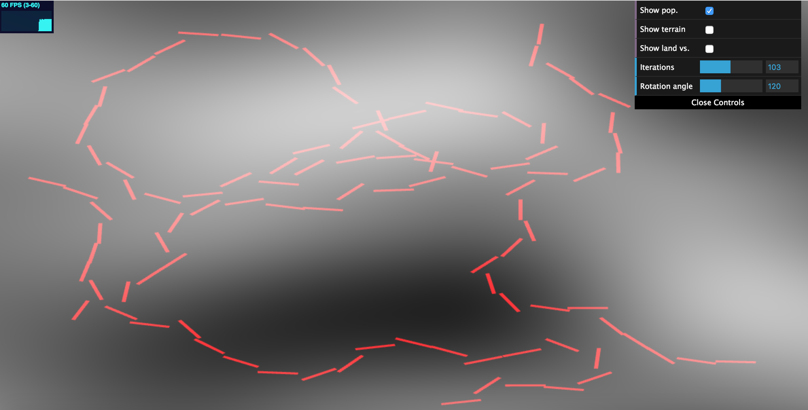
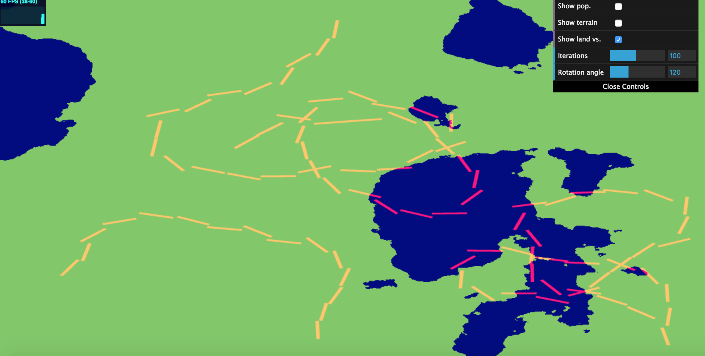
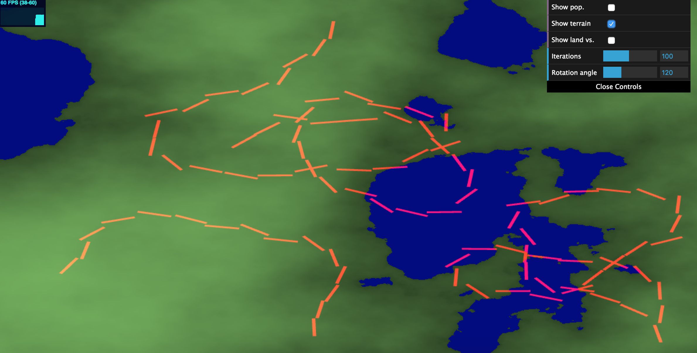
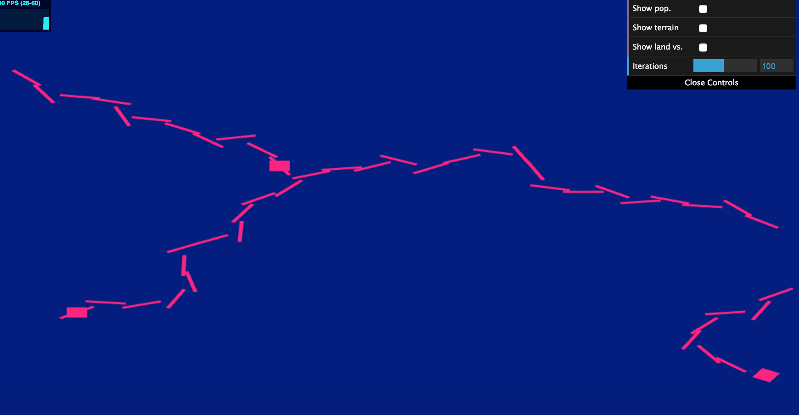

# Road Generation by Annie Su 
Pennkey: anniesu1

## Demo
[Link](https://anniesu1.github.io/road-generation/)

## Resources
- Sig Graph paper on [Procedural Modeling of Cities](proceduralCityGeneration.pdf) 
- Computing [intersections between highways and grid lines](https://github.com/emily-vo/city-forgery/blob/master/src/voronoi.js)

## Implementation Details
### 2D Map Data
- Terrain map (or elevation map) was generated using perlin-based fractal brownian motion. For heights below 0.35 (where
the range of the noise function is [0, 1]), the terrain type is set to water. Otherwise, it is considered land, and colored
on a gradient where lighter represents higher terrain. 
Population level at a specific point is calculated
using vanilla perlin noise. Lighter color corresponds with higher population levels. The user can toggle both the terrain display
and the population display.

Population only

Land vs. water only

Height map only

### Classes representing an LSystem 
- I modified (a lot of) the LSystem that I implemented for the plant l-system project. This new pseudo l-system no longer involves a grammar
but rather a stack-based turtle traversal (with a maximum number of iterations).
- The `TextureHelper` class contains the texture of the terrain map, and has the functions `getPopulation` and `getElevation`, which
help us inform the directionality of the Turtle.
- In the LSystem constructor, I set up 3 city centers, where a very high population level can be found (according to
the noise functions defined above in the 2D Map Data section). At each of these city centers, a Turtle is created in order to
draw highways. 

The squares rendered in this scene are the city centers

### Road system
- I was only able to implement highways, as I had a lot of difficulty with this homework...........the only highway constraint 
is that it may not go out of bounds of the screen (this is done using a simple check to make sure coordinates are within NDC-space).
I do have a constraint written to check whether the coordinate is on water, but did not utilize it for the highways. The global
goal of the highway is to both connect city centers and veer towards areas of higher population. How this words is that I create
a few test turtles that orient in various locations based on a degree value that the user can modify. For each test turtle, 
I move it forward based on its new orientation. 
I utilize the `TextureHelper` to check the population level at each new location, and accept only the test turtle that is 
located at the greatest population. This turtle is pushed onto the turtlehistory stack, unless it snaps to the grid, or 
intersects another existing highway. 

### GUI
- The user may modify the map that is being seen (height map, land vs water map, population density)
- The user may also modify the maximum number of iterations (or depth) by which we pop from the turtlehistory, as well
as the rotation angle for each test turtle. 

### Improvements
- Had I had more time, I would have implemented a grid structure of local roads using the water constraint in addition to the global
goal of connecting all areas to highways.
- I also had a lot of difficulty getting rotations to work properly, as I was unable to figure out how to adjust the pivot so
that each highway segment lined up perfectly.
